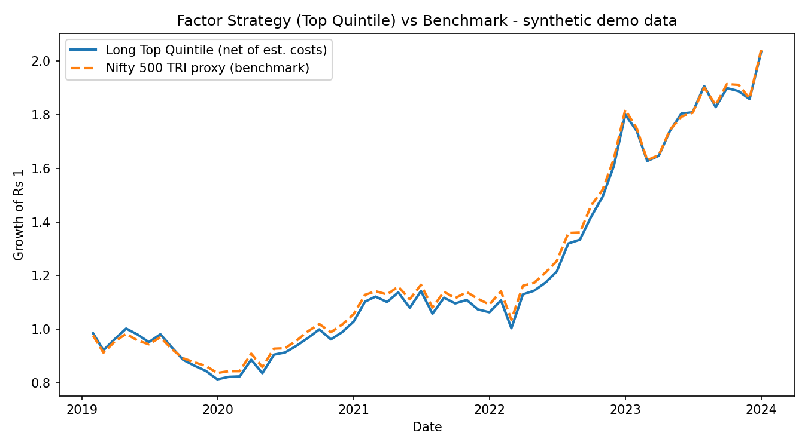
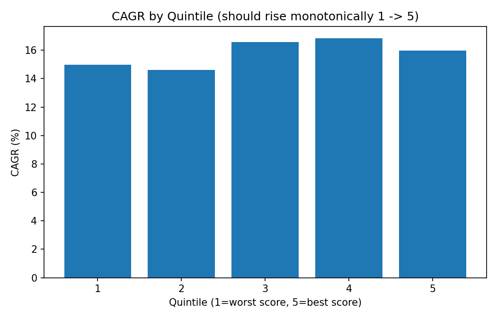

# Nifty 500 Factor Screener & Backtester

A multi-factor equity screening and ranking research pipeline for the Nifty
500 universe. Scores stocks on **valuation**, **momentum**, and **quality**,
ranks them into sector-neutral quintiles each month, and backtests a
long-top-quintile strategy net of estimated transaction costs against a
benchmark — plus the diagnostics (information coefficient, quintile
monotonicity, alpha significance) needed to judge whether the ranking is
actually doing anything.

> **⚠️ Read before citing any numbers from this repo:** the current version
> runs on **synthetic demo data**, not real Nifty 500 prices or fundamentals.
> It is a research **pipeline**, not a validated trading strategy. See
> [Limitations](#limitations--honest-status) below before using any output
> as evidence of "a strategy that beats the market."

## Methodology

```
Universe (Nifty 500)
      |
Prices + Fundamentals (PE, PB, ROE, D/E, 3M/6M returns)
      |
Winsorize outliers, clean negative/loss-making P/E
      |
Cross-sectional z-scores, computed WITHIN (Date x Sector)
      |
Composite score = avg(Valuation, Momentum, Quality)
      |
Quintile ranking (1 = worst, 5 = best) per rebalance date
      |
Long top quintile, equal-weighted, monthly rebalance, net of est. costs
      |
Diagnostics: quintile monotonicity | long-short (Q5-Q1) spread |
             information coefficient | alpha significance test
      |
Compare vs. benchmark (Nifty 500 TRI in production; synthetic proxy in demo)
```

**Factors** (equal-weighted within each pillar, pillars equal-weighted into
a composite):

| Pillar | Metrics | Direction |
|---|---|---|
| Valuation | P/E, P/B | Lower is better (inverted z-score) |
| Momentum | 3M return, 6M return | Higher is better |
| Quality | ROE, Debt/Equity | Higher ROE, lower D/E is better |

**Sector neutrality:** z-scores are computed within `(Date, Sector)`
groups, not just `Date`, so a bank is only compared to other banks and an IT
stock only to other IT stocks. This stops the model from becoming an
accidental sector bet (e.g. penalizing every bank for structurally running
higher D/E than software companies).

**Outlier handling:** all metrics are winsorized at the 1st/99th percentile
before scoring. Negative or zero P/E (loss-making companies) is treated as
the most expensive decile within its group rather than left to invert the
sign of the score.

**Transaction costs:** the backtest applies a cost, in basis points, scaled
by each month's portfolio turnover (fraction of top-quintile holdings that
changed since the prior rebalance) — a simple proxy for brokerage, STT, and
slippage. Default is 10 bps one-way; set `cost_bps=0` in `run_quintile_backtest`
to see the gross-of-cost number.

**Diagnostics beyond the headline equity curve:**
- *Quintile breakdown* — checks CAGR rises roughly monotonically from
  quintile 1 to 5. If it doesn't, the ranking isn't cleanly separating
  winners from losers.
- *Long-short spread (Q5 − Q1)* — the standard clean test of ranking power,
  independent of overall market direction.
- *Information Coefficient (IC)* — the Spearman correlation between the
  composite score and next-month return, averaged across time, with a
  t-test on whether it's distinguishable from zero.
- *Alpha significance test* — a t-test on the strategy's average monthly
  excess return over the benchmark, because a small positive average can
  easily be statistical noise rather than real skill.

## Project structure

```
src/
  data_loader.py    # synthetic demo data generator + yfinance live-price hook
  factors.py         # sector-neutral, winsorized cross-sectional factor scoring
  ranking.py          # quintile bucketing
  backtest.py          # long-top-quintile backtest, costs, turnover, quintile/spread analysis
  diagnostics.py        # information coefficient + alpha significance testing
  main.py                 # CLI entry point, produces all outputs/charts below
data/
  nifty500_sample_tickers.csv   # sample ticker list (swap for the full NSE list)
outputs/                # generated: scored_universe.csv, backtest_results.csv,
                         # quintile_breakdown.csv, long_short_spread.csv,
                         # information_coefficient.csv, metrics.json, charts (*.png)
tests/
  test_pipeline.py      # unit tests: scoring, sector neutrality, negative P/E,
                         # backtest, quintile breakdown, IC, significance
```

## Usage

```bash
pip install -r requirements.txt
python src/main.py --mode demo
pytest tests/
```

## Sample output (demo mode — synthetic data, see disclaimer above)




```
Strategy : CAGR 15.3% | Vol 17.0% | Sharpe 0.57 | Sortino 1.25 | Max DD -18.9%
Index    : CAGR 15.3% | Vol 16.4% | Sharpe 0.59 | Sortino 1.24 | Max DD -14.8%
Alpha vs Index (CAGR): -0.08pp | Hit rate vs index: 51.7%
Avg monthly turnover: 51.3% | Avg monthly cost drag: 0.05%

Information Coefficient: mean 0.0085 (t=1.58, p=0.12 -> not significant)
Alpha significance: mean monthly excess return 0.002%, p=0.98 -> NOT significant
Quintile CAGR: Q1 15.0% | Q2 14.6% | Q3 16.6% | Q4 16.8% | Q5 16.0%  (not monotonic)
```

**Reading this honestly:** once scoring is made sector-neutral and costs are
included, the synthetic demo shows ~no alpha, a statistically insignificant
IC, and a non-monotonic quintile pattern (Q4 beats Q5). That is the correct
and expected outcome on synthetic data with a sector-confounded embedded
premium — it is *not* evidence the methodology fails, but it is a reminder
that a naive backtest which shows a clean-looking edge (as an earlier,
non-sector-neutral, cost-free version of this pipeline did) can be an
artifact of missing controls rather than real skill. That's the whole
reason these diagnostics exist.

## Limitations & honest status

This is a **prototype research pipeline**, not a validated strategy. To
become one, in rough priority order:

1. **Real, point-in-time fundamentals** for the full Nifty 500 — the hardest
   and most important gap. Must be point-in-time (only using data that was
   actually available on that date) to avoid look-ahead bias.
2. **Historical index constituents**, not just the current Nifty 500 list —
   otherwise the backtest has survivorship bias (only testing companies that
   are still around today).
3. **Corporate action adjustments** — splits, bonuses, dividends, mergers,
   delistings.
4. **Nifty 500 TRI** (total return index) as the benchmark, so dividends are
   compared on a like-for-like basis.
5. **Realistic cost modeling** — the current cost model is a simple bps-on-turnover
   proxy; real brokerage, STT, exchange charges, GST, and market impact are
   more complex.
6. Live mode (`--mode live`) currently only fetches prices via `yfinance`;
   fundamentals still need to be merged in from a separate source (e.g.
   screener.in exports, Trendlyne, TickerTape) since yfinance does not
   reliably expose P/E, P/B, ROE, or D/E for NSE-listed stocks.

## What I'd say about this in an interview

- **"Does the strategy work?"** — The current version is a synthetic-data
  research pipeline, so I wouldn't claim real alpha from it. The goal was to
  build the full research workflow — scoring, sector-neutral ranking,
  backtesting with costs, and the diagnostics needed to sanity-check it
  (IC, monotonicity, significance testing). To make it investment-grade I'd
  add point-in-time fundamentals, historical constituents, and out-of-sample
  validation.
- **"Why these factors?"** — Value, momentum, and quality are standard,
  well-studied equity factors: value captures cheapness, momentum captures
  recent price strength, and quality captures profitability and balance
  sheet strength. Combining them reduces reliance on any single signal.
- **"Biggest risks?"** — Look-ahead bias, survivorship bias, transaction
  costs eroding a small edge, sector/size bias, and overfitting to the
  backtest period.

## Possible extensions

- Real fundamentals integration (see Limitations above)
- Rolling out-of-sample validation / walk-forward testing
- Factor-level IC decomposition (value vs. momentum vs. quality individually)
- Streamlit dashboard: screener, factor explorer, backtest, risk, sector view
